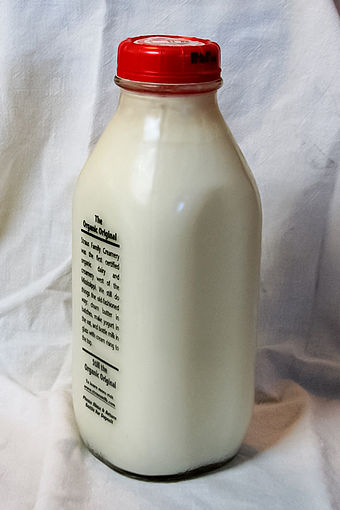

Association Rule Mining
========================================================
author: Li Yutze
date: 2015-05-29
css: custom.css


Background: Itemsets and Transactions
========================================================
left: 60%

  
<span class='caption'>source: shawglobalnews.files.wordpress.com</span>

- - -

Imagine you are the product manager of a __big__ supermarket.


Background: Itemsets and Transactions
========================================================
left: 40%

  
<span class='caption'>source: freegreatpicture.com</span>

- - -

* There are tons of goods (refered as __items__) on the shelves

* And per day thousands of customers comes and take __some__ of the items in their __carts__.


Background: Itemsets and Transactions
========================================================

- Thanks to the technologies of barcodes and databases, these tremendous selling records (refered as __transactions__) can be easily saved.
- These transactions are indexed with identifiers called __TIDs__. In which indentifiers of items, the __Item IDs__ are recorded.

  
<span class='caption'>source: supershuttle.com</span


Background: Itemsets and Transactions
========================================================

## Summary: Background

Now, you, well-trained in mathematics proudly, soon noticed that this hole thing can be described in __set-theory__ languages like:

- All goods in the supermarket with their IDs forms the __Item Set__ $I=\{i_1,\ i_2,\ ...,\ i_n\}$, where $i_k$ is the identifier for the $k^{th}$ item
- A __transaction__ $T_{TID}\subseteq{I}$ is a subset of $I$, identified with $TID$
- All transactions in a given scope forms a __transaction set__ $D = \{T_{TID}\ |\ All\ TID\}$


Motivation: The Beer-Diapers' Problem
========================================================
left: 20%



<span class="caption">source: wikimedia.org</span>
- - -

- It is clear that some items are __more often__ bought together than the others, for example, if one have __bread__ in his cart, he is more likely to have __milk__ with him.

- You, as the product manager, are desiring for these __knowledge__, because they can greatly helps you to manage the loading of your shelves.

- This gives the motivation of this __knowledge mining from data__ process, or __data mining__ process.


Motivation: The Beer-Diapers' Problem
========================================================
left: 25%

<small>One famous case in the field of data mining:  
the story of __Beer and Diaper__.</small>


- - -

> A large supermarket chain, usually Wal-Mart, did an analysis of customers' buying habits and found a statistically __significant correlation between purchases of beer and diapers__. It was theorized that fathers that stopping off to buy diapers for their babies could no longer go down to the pub as often, would buy beer as well. As a result of this finding, the supermarket chain is alleged to have __the diapers next to the beer__, resulting in increased sales of both.

<span class='caption'>web.onetel.net.uk/~hibou/Beer%20and%20Nappies.html<br>
blog.patternbuilders.com/2011/03/02/tales-of-beers-and-diapers</span>


Motivation: The Beer-Diapers' Problem
========================================================

## Summary: Association Rules

To formulate the question of finding such correlations, some mathmatical terms are defined again:

The co-occurence of two subsets of items $A \subseteq{I}$ and $B \subseteq{I}$, where $A \cap B = \emptyset$, is described using a __Rule__: $A \Rightarrow B$,  
for example: $\{milk,\ egg,\ coffee\} \Rightarrow \{bread,\ coke\}$

Whether $A \Rightarrow B$ is a valid rule is calibrated by some measures of __interestingness__, normally __support__ and __confidence__ are used.


Formulation: Associations Rules and Interestingness
========================================================

## Support

The first requirement for these candidate rules are __over-representativeness__. That is, the rule $A \Rightarrow B$ can never be a valid rule only if the occurence frequency of set $A + B$ is over some value.

The frequency is called __support__ in this problem, and the threshold is called __*min-sup*__.

$$
\begin{aligned}
Support(A \Rightarrow B) &= Support(A + B)\\
                         &= \frac{Count_{All\ TID}(A + B \subseteq{D})}{Count(D)}\\
\end{aligned}
$$


Formulation: Associations Rules and Interestingness
========================================================

## Confidence

The __confidence__ on rule $A \Rightarrow B$ is defined as:

$$
\begin{aligned}
Confidence(A \Rightarrow B) &= Pr(A \Rightarrow B) \\
                            &= Pr(A \subseteq{T_TID}\ |\ A \subseteq{T_TID})
\end{aligned}
$$

Which is the conditinal probability of presence of subset $B$ on given the presence of subset $A$. Confidence is also thresholded by a minimum value __min-conf__.


Formulation: Associations Rules and Interestingness
========================================================

## Summary

So the task of __association rule mining__ is formulated:

With given __itemset__ $I$ and the __transaction set__ $D = \{T_{TID}\ |\ T_{TID}\subseteq{I}\}$, find all __association rules__ $A \Rightarrow B$ that:

$$
\begin{aligned}
                   A \cap B &= \emptyset \\
   Support(A \Rightarrow B) &> min\_sup \\
Confidence(A \Rightarrow B) &> min\_conf
\end{aligned}
$$


Algorithms: Divide and Conquer
========================================================

The __find all significant rules__ problem can be divided into two sub-problems:

1. Find all subsets $X$ of $I$ that are __frequent__, or $Support(X) > min\_sup$
2. Find all rules $A \Rightarrow B$ from all $X$ that are frequent, where $A \subset{X}, B \subset{X}\ and\ A \cap B = \emptyset$


Algorithms: Finding Frequent Itemsets
========================================================

### The AIS (Agrawal, Imielinski, Swami) algorithm

The first algorithm that effeciently solves the freqent itemset problem is the an algorithm developed by _Agrawal_, _Imielinski_ & _Swami_.

```
0   Scan the database D 1-st time, Get freq 1-itemsets
1   Scan the the database D k-th time,
2       For each T in D
3           For each i in freq (k-1)-itemset
4               If i in T then
5                   For j in {T - i} count({i, j})++
6   Get freq k-itemsets
7   If !Empty(freq k-itemstes) k++, Goto 1
8   Return {all k-itemsets}
```

Candidates in of k-itemsets are generated by __merging frequent the (k-1)-itemsets with the transactions__.


Algorithms: Finding Frequent Itemsets
========================================================

### The AIS algorithm

The AIS algorithm cut down the candidate number by combining __already known__ (or __*a priori* known__) frequent items with database transactions. How does this work?

__*A priori*__ property: Anti-monotonicity contraint:

> If $X$ violates constraint $c$, then all $X \cup Y$ violate $c$; if $X$ fits with $c$, then all $Y \subseteq{X}$ fit with $c$, such $c$ is an __anti-monotonic__ constraint.


Algorithms: Finding Frequent Itemsets
========================================================

### The AIS algorithm

__Min-sup__ is an __anti-monotonic__ constraint:

- If itemset $X$ is frequent, all subsets of $X$ are frequent
- If itemset $X$ is not frequent, all supersets of $X$ are not frequent

In the AIS algorithm, candidate k-itemsets are generated from the combination of __frequent__ (k-1)-itemsets with database transactions.


The AIS Algorithm in Action!
========================================================
type: prompt
left: 30%

<table>
 <thead>
  <tr>
   <th style="text-align:center;"> tid </th>
   <th style="text-align:right;"> itemset </th>
  </tr>
 </thead>
<tbody>
  <tr>
   <td style="text-align:center;"> T000 </td>
   <td style="text-align:right;"> 1 2 5 </td>
  </tr>
  <tr>
   <td style="text-align:center;"> T100 </td>
   <td style="text-align:right;"> 2 4 </td>
  </tr>
  <tr>
   <td style="text-align:center;"> T200 </td>
   <td style="text-align:right;"> 2 3 </td>
  </tr>
  <tr>
   <td style="text-align:center;"> T300 </td>
   <td style="text-align:right;"> 1 2 4 </td>
  </tr>
  <tr>
   <td style="text-align:center;"> T400 </td>
   <td style="text-align:right;"> 1 3 </td>
  </tr>
  <tr>
   <td style="text-align:center;"> T500 </td>
   <td style="text-align:right;"> 2 3 </td>
  </tr>
  <tr>
   <td style="text-align:center;"> T600 </td>
   <td style="text-align:right;"> 1 3 </td>
  </tr>
  <tr>
   <td style="text-align:center;"> T700 </td>
   <td style="text-align:right;"> 1 2 3 5 </td>
  </tr>
  <tr>
   <td style="text-align:center;"> T800 </td>
   <td style="text-align:right;"> 1 2 3 </td>
  </tr>
  <tr>
   <td style="text-align:center;"> T900 </td>
   <td style="text-align:right;"> 1 2 5 6 </td>
  </tr>
</tbody>
</table>

Transaction set $D$

- - -

The first database scan will generate the count for all 1-itemsets

<table>
<tbody>
  <tr>
   <td style="text-align:left;"> Itemsets </td>
   <td style="text-align:center;"> 1 </td>
   <td style="text-align:center;"> 2 </td>
   <td style="text-align:center;"> 3 </td>
   <td style="text-align:center;"> 4 </td>
   <td style="text-align:center;"> 5 </td>
   <td style="text-align:center;"> 6 </td>
  </tr>
  <tr>
   <td style="text-align:left;"> Count </td>
   <td style="text-align:center;"> 7 </td>
   <td style="text-align:center;"> 8 </td>
   <td style="text-align:center;"> 6 </td>
   <td style="text-align:center;"> 2 </td>
   <td style="text-align:center;"> 3 </td>
   <td style="text-align:center;"> 1 </td>
  </tr>
</tbody>
</table>

And the non-frequent itemsets are removed (_min-sup_ = 30%)

<table>
<tbody>
  <tr>
   <td style="text-align:left;"> Itemsets </td>
   <td style="text-align:center;"> 1 </td>
   <td style="text-align:center;"> 2 </td>
   <td style="text-align:center;"> 3 </td>
   <td style="text-align:center;"> 5 </td>
  </tr>
  <tr>
   <td style="text-align:left;"> Count </td>
   <td style="text-align:center;"> 7 </td>
   <td style="text-align:center;"> 8 </td>
   <td style="text-align:center;"> 6 </td>
   <td style="text-align:center;"> 3 </td>
  </tr>
</tbody>
</table>


The AIS Algorithm in Action!
========================================================
type: prompt
left: 30%

<table>
 <thead>
  <tr>
   <th style="text-align:center;"> tid </th>
   <th style="text-align:right;"> itemset </th>
  </tr>
 </thead>
<tbody>
  <tr>
   <td style="text-align:center;"> T000 </td>
   <td style="text-align:right;"> 1 2 5 </td>
  </tr>
  <tr>
   <td style="text-align:center;"> T100 </td>
   <td style="text-align:right;"> 2 4 </td>
  </tr>
  <tr>
   <td style="text-align:center;"> T200 </td>
   <td style="text-align:right;"> 2 3 </td>
  </tr>
  <tr>
   <td style="text-align:center;"> T300 </td>
   <td style="text-align:right;"> 1 2 4 </td>
  </tr>
  <tr>
   <td style="text-align:center;"> T400 </td>
   <td style="text-align:right;"> 1 3 </td>
  </tr>
  <tr>
   <td style="text-align:center;"> T500 </td>
   <td style="text-align:right;"> 2 3 </td>
  </tr>
  <tr>
   <td style="text-align:center;"> T600 </td>
   <td style="text-align:right;"> 1 3 </td>
  </tr>
  <tr>
   <td style="text-align:center;"> T700 </td>
   <td style="text-align:right;"> 1 2 3 5 </td>
  </tr>
  <tr>
   <td style="text-align:center;"> T800 </td>
   <td style="text-align:right;"> 1 2 3 </td>
  </tr>
  <tr>
   <td style="text-align:center;"> T900 </td>
   <td style="text-align:right;"> 1 2 5 6 </td>
  </tr>
</tbody>
</table>

Transaction set $D$

- - -

And for following iterations, the candidate k-itemsets are generated and counted __on the fly__.

<table>
<tbody>
  <tr>
   <td style="text-align:left;"> Frequent 1-itemsets </td>
   <td style="text-align:left;"> 1 </td>
   <td style="text-align:left;"> 2 </td>
   <td style="text-align:left;"> 3 </td>
   <td style="text-align:left;"> 5 </td>
  </tr>
</tbody>
</table>

- Conbines with $T_{000} = \{1,\ 2,\ 5\}$,  
generates $\{\{1,\ 2\},\ \{1,\ 5\},\ \{2,\ 5\}\}$

- Conbines with $T_{100} = \{2,\ 4\}$,  
generates $\{2,\ 4\}$

- Conbines with $T_{200} = \{2,\ 3\}$,  
generates $\{\{2,\ 3\}\}$  
...


The AIS Algorithm in Action!
========================================================
type: prompt
left: 30%

<table>
 <thead>
  <tr>
   <th style="text-align:center;"> tid </th>
   <th style="text-align:right;"> itemset </th>
  </tr>
 </thead>
<tbody>
  <tr>
   <td style="text-align:center;"> T000 </td>
   <td style="text-align:right;"> 1 2 5 </td>
  </tr>
  <tr>
   <td style="text-align:center;"> T100 </td>
   <td style="text-align:right;"> 2 4 </td>
  </tr>
  <tr>
   <td style="text-align:center;"> T200 </td>
   <td style="text-align:right;"> 2 3 </td>
  </tr>
  <tr>
   <td style="text-align:center;"> T300 </td>
   <td style="text-align:right;"> 1 2 4 </td>
  </tr>
  <tr>
   <td style="text-align:center;"> T400 </td>
   <td style="text-align:right;"> 1 3 </td>
  </tr>
  <tr>
   <td style="text-align:center;"> T500 </td>
   <td style="text-align:right;"> 2 3 </td>
  </tr>
  <tr>
   <td style="text-align:center;"> T600 </td>
   <td style="text-align:right;"> 1 3 </td>
  </tr>
  <tr>
   <td style="text-align:center;"> T700 </td>
   <td style="text-align:right;"> 1 2 3 5 </td>
  </tr>
  <tr>
   <td style="text-align:center;"> T800 </td>
   <td style="text-align:right;"> 1 2 3 </td>
  </tr>
  <tr>
   <td style="text-align:center;"> T900 </td>
   <td style="text-align:right;"> 1 2 5 6 </td>
  </tr>
</tbody>
</table>

Transaction set $D$

- - -

And the candidate 2-itemsets are generated and counted as

<table>
<tbody>
  <tr>
   <td style="text-align:left;"> Itemsets </td>
   <td style="text-align:center;"> 1 2 </td>
   <td style="text-align:center;"> 1 5 </td>
   <td style="text-align:center;"> 2 5 </td>
   <td style="text-align:center;"> 2 4 </td>
   <td style="text-align:center;"> 2 3 </td>
   <td style="text-align:center;"> 1 4 </td>
   <td style="text-align:center;"> ... </td>
  </tr>
  <tr>
   <td style="text-align:left;"> Count </td>
   <td style="text-align:center;"> 5 </td>
   <td style="text-align:center;"> 3 </td>
   <td style="text-align:center;"> 3 </td>
   <td style="text-align:center;"> 2 </td>
   <td style="text-align:center;"> 4 </td>
   <td style="text-align:center;"> 1 </td>
   <td style="text-align:center;"> ... </td>
  </tr>
</tbody>
</table>

Hence the frequent 2-itemsets

<table>
<tbody>
  <tr>
   <td style="text-align:left;"> Itemsets </td>
   <td style="text-align:center;"> 1 2 </td>
   <td style="text-align:center;"> 1 5 </td>
   <td style="text-align:center;"> 2 5 </td>
   <td style="text-align:center;"> 2 3 </td>
   <td style="text-align:center;"> 1 3 </td>
  </tr>
  <tr>
   <td style="text-align:left;"> Count </td>
   <td style="text-align:center;"> 5 </td>
   <td style="text-align:center;"> 3 </td>
   <td style="text-align:center;"> 3 </td>
   <td style="text-align:center;"> 4 </td>
   <td style="text-align:center;"> 4 </td>
  </tr>
</tbody>
</table>


The AIS Algorithm in Action!
========================================================
type: prompt
left: 30%

<table>
 <thead>
  <tr>
   <th style="text-align:center;"> tid </th>
   <th style="text-align:right;"> itemset </th>
  </tr>
 </thead>
<tbody>
  <tr>
   <td style="text-align:center;"> T000 </td>
   <td style="text-align:right;"> 1 2 5 </td>
  </tr>
  <tr>
   <td style="text-align:center;"> T100 </td>
   <td style="text-align:right;"> 2 4 </td>
  </tr>
  <tr>
   <td style="text-align:center;"> T200 </td>
   <td style="text-align:right;"> 2 3 </td>
  </tr>
  <tr>
   <td style="text-align:center;"> T300 </td>
   <td style="text-align:right;"> 1 2 4 </td>
  </tr>
  <tr>
   <td style="text-align:center;"> T400 </td>
   <td style="text-align:right;"> 1 3 </td>
  </tr>
  <tr>
   <td style="text-align:center;"> T500 </td>
   <td style="text-align:right;"> 2 3 </td>
  </tr>
  <tr>
   <td style="text-align:center;"> T600 </td>
   <td style="text-align:right;"> 1 3 </td>
  </tr>
  <tr>
   <td style="text-align:center;"> T700 </td>
   <td style="text-align:right;"> 1 2 3 5 </td>
  </tr>
  <tr>
   <td style="text-align:center;"> T800 </td>
   <td style="text-align:right;"> 1 2 3 </td>
  </tr>
  <tr>
   <td style="text-align:center;"> T900 </td>
   <td style="text-align:right;"> 1 2 5 6 </td>
  </tr>
</tbody>
</table>

Transaction set $D$

- - -

Frequent 2-itemsets

<table>
<tbody>
  <tr>
   <td style="text-align:left;"> Itemsets </td>
   <td style="text-align:center;"> 1 2 </td>
   <td style="text-align:center;"> 1 5 </td>
   <td style="text-align:center;"> 2 5 </td>
   <td style="text-align:center;"> 2 3 </td>
   <td style="text-align:center;"> 1 3 </td>
  </tr>
</tbody>
</table>

Then candidate 3-itemsets are generated by combining frequent 2-itemsets with transactions:

<table>
<tbody>
  <tr>
   <td style="text-align:left;"> Itemsets </td>
   <td style="text-align:center;"> 1 2 5 </td>
   <td style="text-align:center;"> 1 2 4 </td>
   <td style="text-align:center;"> 1 2 3 </td>
   <td style="text-align:center;"> 1 3 5 </td>
   <td style="text-align:center;"> 1 2 6 </td>
   <td style="text-align:center;"> ... </td>
  </tr>
  <tr>
   <td style="text-align:left;"> Count </td>
   <td style="text-align:center;"> 3 </td>
   <td style="text-align:center;"> 1 </td>
   <td style="text-align:center;"> 2 </td>
   <td style="text-align:center;"> 1 </td>
   <td style="text-align:center;"> 1 </td>
   <td style="text-align:center;"> ... </td>
  </tr>
</tbody>
</table>

And so fourth...


Algorithms: Finding Frequent Itemsets
========================================================

### The AIS algorithm: Summary

- Use _a priori_ knowledge to reduce candidate size
- Generate candidate while scanning the database (__on the fly__ generating)

Drawbacks:

- __On the fly__ generating candidates actually increase the time of scanning the database
- Aternating length candidate list makes it hard to count

### <s style="font-size:30px;color:#999">Neng Bu Neng Zai Gei Li Dian?</s> Can this be more powerful?


Algorithms: Finding Frequent Itemsets
========================================================

### The Apriori algorithm

Instead of generating candidate list __on the fly__, which only __partly__ utilized the a priori property of the _min-sup_ constraint,

Apriori algorithm, as the name indicates, __fully__ exploit the anti-monotonicity, by generating the candidate k-itemset __only use the frequent (k-1)-itemset.__

- __AIS__:  
frequent (k-1)-itemsets + transactions $\rightarrow$ candidate k-itemsets
- __Apriori__:  
frequent (k-1)-itemsets $\rightarrow$ candidate k-itemsets


Algorithms: Finding Frequent Itemsets
========================================================

### The Apriori algorithm

How can this be possible? Remember the anti-monotonicity rule:

- If itemset $X$ is frequent, all subsets of $X$ are frequent

Thus we can conclude:

- If any (k-1)-subset $Y$ of k-itemset $X$ is not presented in the frequent (k-1)-itemset, $X$ is not be frequent

So a handy superset of the frequent k-itemsets can be easily generated by merging the (k-1)-itemsets


Algorithms: Finding Frequent Itemsets
========================================================

### The Apriori algorithm

```
0   Scan the database D 1-st time, Get freq 1-itemsets
1   For each i in freq (k-1)-itemsets
2       For each j > i in freq (k-1)-itemsets
3           If Count(U <= i union j) = k
4               If all subsets of U in freq (k-1)-itemsets
5                   Append(candidate k-itemsets, U)
6   Scan the database D k-th time, Get freq k-itemsets
7   If !Empty(freq k-itemstes) k++, Goto 1
8   Return {all k-itemsets}
```

Compare: AIS

```
1   Scan the the database D k-th time,
2       For each T in D ## Scanning while generating, costly
3           For each i in freq (k-1)-itemset
4               If i in T then
5                   For j in {T - i} count({i, j})++
6   Get freq k-itemsets
```


The Apriori Algorithm in Action!
========================================================
type: prompt
left: 30%

<table>
 <thead>
  <tr>
   <th style="text-align:center;"> tid </th>
   <th style="text-align:right;"> itemset </th>
  </tr>
 </thead>
<tbody>
  <tr>
   <td style="text-align:center;"> T000 </td>
   <td style="text-align:right;"> 1 2 5 </td>
  </tr>
  <tr>
   <td style="text-align:center;"> T100 </td>
   <td style="text-align:right;"> 2 4 </td>
  </tr>
  <tr>
   <td style="text-align:center;"> T200 </td>
   <td style="text-align:right;"> 2 3 </td>
  </tr>
  <tr>
   <td style="text-align:center;"> T300 </td>
   <td style="text-align:right;"> 1 2 4 </td>
  </tr>
  <tr>
   <td style="text-align:center;"> T400 </td>
   <td style="text-align:right;"> 1 3 </td>
  </tr>
  <tr>
   <td style="text-align:center;"> T500 </td>
   <td style="text-align:right;"> 2 3 </td>
  </tr>
  <tr>
   <td style="text-align:center;"> T600 </td>
   <td style="text-align:right;"> 1 3 </td>
  </tr>
  <tr>
   <td style="text-align:center;"> T700 </td>
   <td style="text-align:right;"> 1 2 3 5 </td>
  </tr>
  <tr>
   <td style="text-align:center;"> T800 </td>
   <td style="text-align:right;"> 1 2 3 </td>
  </tr>
  <tr>
   <td style="text-align:center;"> T900 </td>
   <td style="text-align:right;"> 1 2 5 6 </td>
  </tr>
</tbody>
</table>

Transaction set $D$

- - -

The first database scan is the same as AIS, frequent 1-itemsets are:

<table>
<tbody>
  <tr>
   <td style="text-align:left;"> Itemsets </td>
   <td style="text-align:center;"> 1 </td>
   <td style="text-align:center;"> 2 </td>
   <td style="text-align:center;"> 3 </td>
   <td style="text-align:center;"> 5 </td>
  </tr>
  <tr>
   <td style="text-align:left;"> Count </td>
   <td style="text-align:center;"> 7 </td>
   <td style="text-align:center;"> 8 </td>
   <td style="text-align:center;"> 6 </td>
   <td style="text-align:center;"> 3 </td>
  </tr>
</tbody>
</table>

Then the candidate 2-itemsets are generated by simply crossing multiplying this frequent 1-sets by themselves.

<table>
<tbody>
  <tr>
   <td style="text-align:left;"> Itemset </td>
   <td style="text-align:center;"> 1 2 </td>
   <td style="text-align:center;"> 1 3 </td>
   <td style="text-align:center;"> 1 5 </td>
   <td style="text-align:center;"> 2 3 </td>
   <td style="text-align:center;"> 2 5 </td>
   <td style="text-align:center;"> 3 5 </td>
  </tr>
</tbody>
</table>

No need for pruning at this time.


The Apriori Algorithm in Action!
========================================================
type: prompt
left: 30%

<table>
 <thead>
  <tr>
   <th style="text-align:center;"> tid </th>
   <th style="text-align:right;"> itemset </th>
  </tr>
 </thead>
<tbody>
  <tr>
   <td style="text-align:center;"> T000 </td>
   <td style="text-align:right;"> 1 2 5 </td>
  </tr>
  <tr>
   <td style="text-align:center;"> T100 </td>
   <td style="text-align:right;"> 2 4 </td>
  </tr>
  <tr>
   <td style="text-align:center;"> T200 </td>
   <td style="text-align:right;"> 2 3 </td>
  </tr>
  <tr>
   <td style="text-align:center;"> T300 </td>
   <td style="text-align:right;"> 1 2 4 </td>
  </tr>
  <tr>
   <td style="text-align:center;"> T400 </td>
   <td style="text-align:right;"> 1 3 </td>
  </tr>
  <tr>
   <td style="text-align:center;"> T500 </td>
   <td style="text-align:right;"> 2 3 </td>
  </tr>
  <tr>
   <td style="text-align:center;"> T600 </td>
   <td style="text-align:right;"> 1 3 </td>
  </tr>
  <tr>
   <td style="text-align:center;"> T700 </td>
   <td style="text-align:right;"> 1 2 3 5 </td>
  </tr>
  <tr>
   <td style="text-align:center;"> T800 </td>
   <td style="text-align:right;"> 1 2 3 </td>
  </tr>
  <tr>
   <td style="text-align:center;"> T900 </td>
   <td style="text-align:right;"> 1 2 5 6 </td>
  </tr>
</tbody>
</table>

Transaction set $D$

- - -

2-itemsets are counted with the 2-nd database scan.

<table>
<tbody>
  <tr>
   <td style="text-align:left;"> Itemset </td>
   <td style="text-align:center;"> 1 2 </td>
   <td style="text-align:center;"> 1 3 </td>
   <td style="text-align:center;"> 1 5 </td>
   <td style="text-align:center;"> 2 3 </td>
   <td style="text-align:center;"> 2 5 </td>
   <td style="text-align:center;"> 3 5 </td>
  </tr>
  <tr>
   <td style="text-align:left;"> Count </td>
   <td style="text-align:center;"> 5 </td>
   <td style="text-align:center;"> 4 </td>
   <td style="text-align:center;"> 3 </td>
   <td style="text-align:center;"> 4 </td>
   <td style="text-align:center;"> 3 </td>
   <td style="text-align:center;"> 1 </td>
  </tr>
</tbody>
</table>

And the frequent 2-sets are

<table>
<tbody>
  <tr>
   <td style="text-align:left;"> Itemset </td>
   <td style="text-align:center;"> 1 2 </td>
   <td style="text-align:center;"> 1 3 </td>
   <td style="text-align:center;"> 1 5 </td>
   <td style="text-align:center;"> 2 3 </td>
   <td style="text-align:center;"> 2 5 </td>
  </tr>
  <tr>
   <td style="text-align:left;"> Count </td>
   <td style="text-align:center;"> 5 </td>
   <td style="text-align:center;"> 4 </td>
   <td style="text-align:center;"> 3 </td>
   <td style="text-align:center;"> 4 </td>
   <td style="text-align:center;"> 3 </td>
  </tr>
</tbody>
</table>


The Apriori Algorithm in Action!
========================================================
type: prompt
left: 30%

<table>
 <thead>
  <tr>
   <th style="text-align:center;"> tid </th>
   <th style="text-align:right;"> itemset </th>
  </tr>
 </thead>
<tbody>
  <tr>
   <td style="text-align:center;"> T000 </td>
   <td style="text-align:right;"> 1 2 5 </td>
  </tr>
  <tr>
   <td style="text-align:center;"> T100 </td>
   <td style="text-align:right;"> 2 4 </td>
  </tr>
  <tr>
   <td style="text-align:center;"> T200 </td>
   <td style="text-align:right;"> 2 3 </td>
  </tr>
  <tr>
   <td style="text-align:center;"> T300 </td>
   <td style="text-align:right;"> 1 2 4 </td>
  </tr>
  <tr>
   <td style="text-align:center;"> T400 </td>
   <td style="text-align:right;"> 1 3 </td>
  </tr>
  <tr>
   <td style="text-align:center;"> T500 </td>
   <td style="text-align:right;"> 2 3 </td>
  </tr>
  <tr>
   <td style="text-align:center;"> T600 </td>
   <td style="text-align:right;"> 1 3 </td>
  </tr>
  <tr>
   <td style="text-align:center;"> T700 </td>
   <td style="text-align:right;"> 1 2 3 5 </td>
  </tr>
  <tr>
   <td style="text-align:center;"> T800 </td>
   <td style="text-align:right;"> 1 2 3 </td>
  </tr>
  <tr>
   <td style="text-align:center;"> T900 </td>
   <td style="text-align:right;"> 1 2 5 6 </td>
  </tr>
</tbody>
</table>

Transaction set $D$

- - -

Generating candidate 3-sets with requent 2-itemsets

<table>
<tbody>
  <tr>
   <td style="text-align:left;"> Itemset </td>
   <td style="text-align:center;"> 1 2 </td>
   <td style="text-align:center;"> 1 3 </td>
   <td style="text-align:center;"> 1 5 </td>
   <td style="text-align:center;"> 2 3 </td>
   <td style="text-align:center;"> 2 5 </td>
  </tr>
</tbody>
</table>

- $\{1,\ 2\} \cup \{1, 3\} = \{1,\ 2,\ 3\}$,  
$\{2,\ 3\}$ is in the feq 2-sets, __valid__
- $\{1,\ 2\} \cup \{1, 5\} = \{1,\ 2,\ 5\}$,  
$\{2,\ 5\}$ is in the feq 2-sets, __valid__
- $\{1,\ 2\} \cup \{2, 3\}$ and $\{1,\ 2\} \cup \{2, 5\}$
- $\{1,\ 3\} \cup \{1, 5\} = \{1,\ 3,\ 5\}$,  
$\{3,\ 5\}$ is __not__ in the feq 2-sets, __pruned__  
...


The Apriori Algorithm in Action!
========================================================
type: prompt
left: 30%

<table>
 <thead>
  <tr>
   <th style="text-align:center;"> tid </th>
   <th style="text-align:right;"> itemset </th>
  </tr>
 </thead>
<tbody>
  <tr>
   <td style="text-align:center;"> T000 </td>
   <td style="text-align:right;"> 1 2 5 </td>
  </tr>
  <tr>
   <td style="text-align:center;"> T100 </td>
   <td style="text-align:right;"> 2 4 </td>
  </tr>
  <tr>
   <td style="text-align:center;"> T200 </td>
   <td style="text-align:right;"> 2 3 </td>
  </tr>
  <tr>
   <td style="text-align:center;"> T300 </td>
   <td style="text-align:right;"> 1 2 4 </td>
  </tr>
  <tr>
   <td style="text-align:center;"> T400 </td>
   <td style="text-align:right;"> 1 3 </td>
  </tr>
  <tr>
   <td style="text-align:center;"> T500 </td>
   <td style="text-align:right;"> 2 3 </td>
  </tr>
  <tr>
   <td style="text-align:center;"> T600 </td>
   <td style="text-align:right;"> 1 3 </td>
  </tr>
  <tr>
   <td style="text-align:center;"> T700 </td>
   <td style="text-align:right;"> 1 2 3 5 </td>
  </tr>
  <tr>
   <td style="text-align:center;"> T800 </td>
   <td style="text-align:right;"> 1 2 3 </td>
  </tr>
  <tr>
   <td style="text-align:center;"> T900 </td>
   <td style="text-align:right;"> 1 2 5 6 </td>
  </tr>
</tbody>
</table>

Transaction set $D$

- - -

Candidate 3-itemsets are counted with a 3-rd database scan

<table>
<tbody>
  <tr>
   <td style="text-align:left;"> Itemsets </td>
   <td style="text-align:center;"> 1 2 3 </td>
   <td style="text-align:center;"> 1 2 5 </td>
   <td style="text-align:center;"> 1 3 5 </td>
   <td style="text-align:center;"> 2 3 5 </td>
  </tr>
  <tr>
   <td style="text-align:left;"> Count </td>
   <td style="text-align:center;"> 2 </td>
   <td style="text-align:center;"> 3 </td>
   <td style="text-align:center;"> 1 </td>
   <td style="text-align:center;"> 1 </td>
  </tr>
</tbody>
</table>

And frequent 3-itemsets are

<table>
<tbody>
  <tr>
   <td style="text-align:left;"> Itemsets </td>
   <td style="text-align:center;"> 1 2 3 </td>
   <td style="text-align:center;"> 1 2 5 </td>
  </tr>
  <tr>
   <td style="text-align:left;"> Count </td>
   <td style="text-align:center;"> 2 </td>
   <td style="text-align:center;"> 3 </td>
  </tr>
</tbody>
</table>


Algorithms: Finding Frequent Itemsets
========================================================

### The Apriori algorithm: Summary

- __Fully__ use _a priori_ knowledge to reduce candidate size
- Generate candidate __before__ scanning the database

- For large databases this algorithm is still costy, because it still scans the database several times

### <s style="font-size:30px;color:#999">Neng Bu Neng Zai Gei Li Dian?</s> Can this be more powerful?

- Alternative: AprioriTID


Algorithms: Finding Frequent Itemsets
========================================================

### The AprioriTid algorithm: Brief

For the k-th database scan, in stead of scan the original database, an __alternative base__ is generated and scaned:

```
0   Scan the database D 1-st time, Get freq 1-itemsets
1   Alternative D'[1, ] <= D 
2   For each T in D
3       For each i in T & in freq (k-1)-sets
4           For each j > i in T & in freq (k-1)-sets
5               Append(D'[k, T], i union j)
6   Scan the database D'[k, T], Get freq k-itemsets
7   If !Empty(freq k-itemstes) k++, Goto 1
8   Return {all k-itemsets}
```


The AprioriTid Algorithm in Action!
========================================================
type: prompt
left: 30%

<table>
 <thead>
  <tr>
   <th style="text-align:center;"> tid </th>
   <th style="text-align:right;"> itemset </th>
  </tr>
 </thead>
<tbody>
  <tr>
   <td style="text-align:center;"> T000 </td>
   <td style="text-align:right;"> 1 2 5 </td>
  </tr>
  <tr>
   <td style="text-align:center;"> T100 </td>
   <td style="text-align:right;"> 2 4 </td>
  </tr>
  <tr>
   <td style="text-align:center;"> T200 </td>
   <td style="text-align:right;"> 2 3 </td>
  </tr>
  <tr>
   <td style="text-align:center;"> T300 </td>
   <td style="text-align:right;"> 1 2 4 </td>
  </tr>
  <tr>
   <td style="text-align:center;"> T400 </td>
   <td style="text-align:right;"> 1 3 </td>
  </tr>
  <tr>
   <td style="text-align:center;"> T500 </td>
   <td style="text-align:right;"> 2 3 </td>
  </tr>
  <tr>
   <td style="text-align:center;"> T600 </td>
   <td style="text-align:right;"> 1 3 </td>
  </tr>
  <tr>
   <td style="text-align:center;"> T700 </td>
   <td style="text-align:right;"> 1 2 3 5 </td>
  </tr>
  <tr>
   <td style="text-align:center;"> T800 </td>
   <td style="text-align:right;"> 1 2 3 </td>
  </tr>
  <tr>
   <td style="text-align:center;"> T900 </td>
   <td style="text-align:right;"> 1 2 5 6 </td>
  </tr>
</tbody>
</table>

Transaction set $D$

- - -

<table>
 <thead>
  <tr>
   <th style="text-align:center;"> tid </th>
   <th style="text-align:right;"> itemset </th>
  </tr>
 </thead>
<tbody>
  <tr>
   <td style="text-align:center;"> T000 </td>
   <td style="text-align:right;"> { 1 } { 2 } { 5 } </td>
  </tr>
  <tr>
   <td style="text-align:center;"> T100 </td>
   <td style="text-align:right;"> { 2 } { 4 } </td>
  </tr>
  <tr>
   <td style="text-align:center;"> T200 </td>
   <td style="text-align:right;"> { 2 } { 3 } </td>
  </tr>
  <tr>
   <td style="text-align:center;"> T300 </td>
   <td style="text-align:right;"> { 1 } { 2 } { 4 } </td>
  </tr>
  <tr>
   <td style="text-align:center;"> T400 </td>
   <td style="text-align:right;"> { 1 } { 3 } </td>
  </tr>
  <tr>
   <td style="text-align:center;"> T500 </td>
   <td style="text-align:right;"> { 2 } { 3 } </td>
  </tr>
  <tr>
   <td style="text-align:center;"> T600 </td>
   <td style="text-align:right;"> { 1 } { 3 } </td>
  </tr>
  <tr>
   <td style="text-align:center;"> T700 </td>
   <td style="text-align:right;"> { 1 } { 2 } { 3 } { 5 } </td>
  </tr>
  <tr>
   <td style="text-align:center;"> T800 </td>
   <td style="text-align:right;"> { 1 } { 2 } { 3 } </td>
  </tr>
  <tr>
   <td style="text-align:center;"> T900 </td>
   <td style="text-align:right;"> { 1 } { 2 } { 5 } { 6 } </td>
  </tr>
</tbody>
</table>


Accordingly, $D_{1, TID}$, is just regard the items as 1-sets


The AprioriTid Algorithm in Action!
========================================================
type: prompt
left: 40%

<table>
 <thead>
  <tr>
   <th style="text-align:center;"> tid </th>
   <th style="text-align:right;"> itemset </th>
  </tr>
 </thead>
<tbody>
  <tr>
   <td style="text-align:center;"> T000 </td>
   <td style="text-align:right;"> { 1 } { 2 } { 5 } </td>
  </tr>
  <tr>
   <td style="text-align:center;"> T100 </td>
   <td style="text-align:right;"> { 2 } { 4 } </td>
  </tr>
  <tr>
   <td style="text-align:center;"> T200 </td>
   <td style="text-align:right;"> { 2 } { 3 } </td>
  </tr>
  <tr>
   <td style="text-align:center;"> T300 </td>
   <td style="text-align:right;"> { 1 } { 2 } { 4 } </td>
  </tr>
  <tr>
   <td style="text-align:center;"> T400 </td>
   <td style="text-align:right;"> { 1 } { 3 } </td>
  </tr>
  <tr>
   <td style="text-align:center;"> T500 </td>
   <td style="text-align:right;"> { 2 } { 3 } </td>
  </tr>
  <tr>
   <td style="text-align:center;"> T600 </td>
   <td style="text-align:right;"> { 1 } { 3 } </td>
  </tr>
  <tr>
   <td style="text-align:center;"> T700 </td>
   <td style="text-align:right;"> { 1 } { 2 } { 3 } { 5 } </td>
  </tr>
  <tr>
   <td style="text-align:center;"> T800 </td>
   <td style="text-align:right;"> { 1 } { 2 } { 3 } </td>
  </tr>
  <tr>
   <td style="text-align:center;"> T900 </td>
   <td style="text-align:right;"> { 1 } { 2 } { 5 } { 6 } </td>
  </tr>
</tbody>
</table>

Alternative set $D_{1, TID}$

- - -

With frequent 1-sets {1}, {2}, {3}, {5}, $D_{2, TID}$ is generated

<table>
 <thead>
  <tr>
   <th style="text-align:center;"> tid </th>
   <th style="text-align:right;"> itemset </th>
  </tr>
 </thead>
<tbody>
  <tr>
   <td style="text-align:center;"> T000 </td>
   <td style="text-align:right;"> { 1 2 } { 1 5 } { 2 5 } </td>
  </tr>
  <tr>
   <td style="text-align:center;"> T100 </td>
   <td style="text-align:right;"> { } </td>
  </tr>
  <tr>
   <td style="text-align:center;"> T200 </td>
   <td style="text-align:right;"> { 2 3 } </td>
  </tr>
  <tr>
   <td style="text-align:center;"> T300 </td>
   <td style="text-align:right;"> { 1 2 } </td>
  </tr>
  <tr>
   <td style="text-align:center;"> T400 </td>
   <td style="text-align:right;"> { 1 3 } </td>
  </tr>
  <tr>
   <td style="text-align:center;"> ... </td>
   <td style="text-align:right;"> ... </td>
  </tr>
</tbody>
</table>

Alternative set $D_{2, TID}$


Algorithms: Finding Frequent Itemsets
========================================================

### The AprioriTid algorithm: Summary

- Generate __alternative__ transaction database and, instead of scan the original database, the alternative base is scaned


Algorithms: Generate Association Rules
========================================================

After the __frequent itemsets__ are generated, the second phase is to generate valid rules from these frequent itemsets, using __confidence__ as the cut off. The algorithms is simple

```
0   For each set i in freq k-sets, k > 1
1       For l <= 1 to Count(i) - 1
2           For each subset j of i that Count(j) = l
3               If Conf("i => j") > min_conf
4                   Append(Rules, "i => j")
5   Return {Rules}
```


Reference
=========================================================

<small>
- "__Association Rule Mining: A Survey__", _QK Zhao et all_, Technical Report, CAIS, Nanyang Tech Univ, Singapore, 2003-01-16.
- "__Fast Algorithms for Mining Association Rules__", _R. Agrawal et al_.
- "__Data Mining: Concepts and Techniques__", _JW Han at al_, 3-rd Ed.
- "__An Introduction to Data Mining: Association Rules__", \<saedsayad.com  
/data_mining_map.htm\>
</small>
